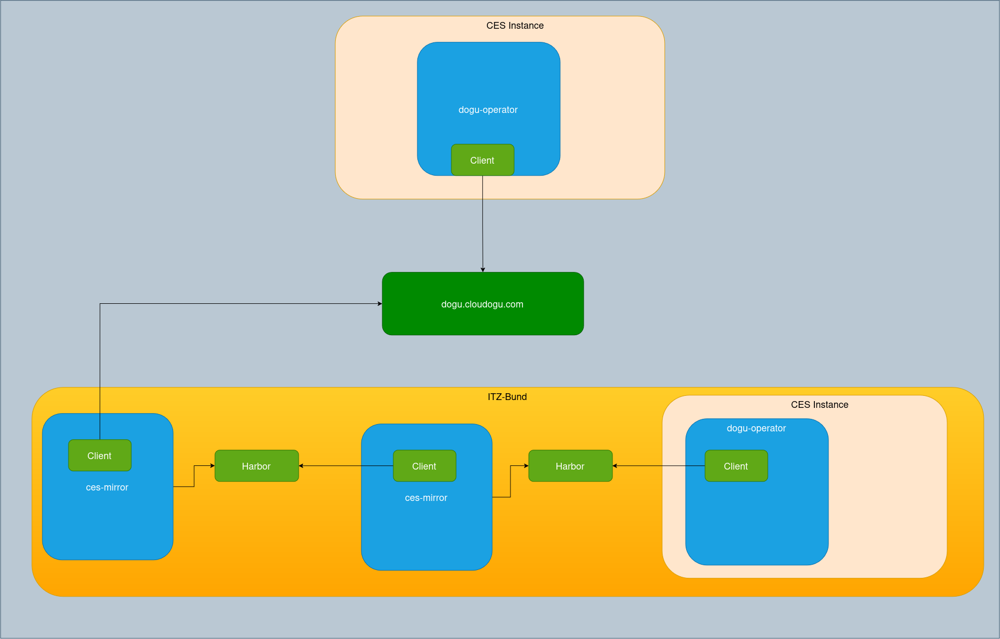
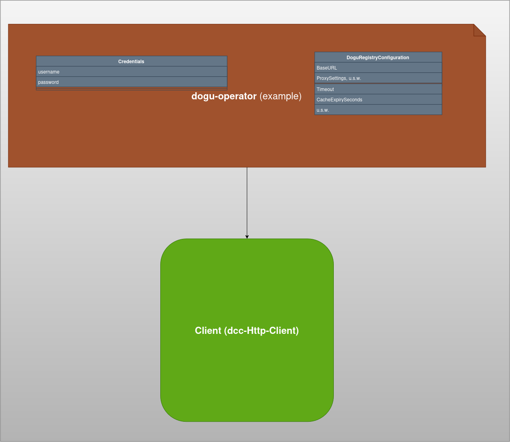

# Developer Guide — DCC client (English)

## Overview

This guide explains how to use and extend the DCC HTTP client implemented in doguv3/doguregistry. 
It covers the Client interface, configuration options, error handling, and practical recommendations for integrating and testing the client.

## Components

- Client (interface)
  - GetLatest(ctx, namespace, name) -> *doguv3.Dogu
  - Get(ctx, identifier) -> *doguv3.Dogu
  - GetVersions(ctx, namespace, name) -> []string
  - GetAll(ctx) -> []doguv3.Identifier

- Implementation: DccHttpClient
  - Created via New(doguRegistryConfiguration *config.DoguRegistryConfiguration, credentials *config.Credentials)
  - Respects context cancellation and request timeouts
  - Optional local caching (otter)
  - Header-Fields (User-Agent, Authorization) 
  - Query Parameters are not part of the logs
  - TLS configuration
  - Logging

## Configuration

DoguRegistryConfiguration fields (config.DoguRegistryConfiguration):
- BaseURL (string) – base URL of the remote DCC API. Required.
- ProxySettings (struct) – Enabled, Server, Port, Username, Password. If Enabled, the client configures an http.Transport proxy. Proxy URL is built with http scheme.
- Timeout (int64) – request timeout in seconds (default 10s when zero)
- DisableCache (bool) – disable in-memory caching
- CacheExpirySeconds (int64) – TTL for cache entries
- CacheMaximumDogus (int) – maximum entries in cache
- InsecureSkipVerify (bool) – skip TLS certificate verification
- UserAgent (string) – value to be used for User-Agent header (ex: dogu-operator)

## Credentials

- Credentials{Username, Password} are applied as HTTP Basic Auth on outgoing GET requests.
- Never commit credentials in source; pass them securely from environment/secret manager.


## Usecases and configuration




## Error handling (clienterrors)

The client uses typed errors to make handling easier:
- clienterrors.IsNotFoundError(err) – 404
- clienterrors.IsUnauthorizedError(err) – 401
- clienterrors.IsForbiddenError(err) – 403
- clienterrors.IsConnectionError(err) – connection or 500
- clienterrors.IsGenericError(err) – other errors

These functions rely on errors.As, so prefer to check with them rather than string matching. Example:

    dogu, err := client.Get(ctx, ident)
    if err != nil {
        switch {
        case clienterrors.IsNotFoundError(err):
            // handle not found
        case clienterrors.IsUnauthorizedError(err):
            // reauthenticate
        default:
            // generic error
        }
    }

## HTTP & Security considerations

- Context propagation: all public methods accept context.Context and the HTTP requests are created with NewRequestWithContext.
- Timeouts: configure Timeout in config; default 10s.
- TLS: the client supports configuring TLS behavior through transport settings. Avoid disabling certificate verification in production; prefer providing a custom root CA or certificate pinning.
- Logging: LoggingRoundTripper redacts URL user info and query parameters; do not log Authorization headers or secrets.

## Performance & Robustness

- Response body reads are limited to a sensible maximum (8MB) to avoid OOM. If you expect larger payloads, increase the limit thoughtfully or stream decode via json.Decoder with LimitReader.
- The cache uses otter with an access-based expiry calculator. Tests should avoid brittle timing assertions; prefer mocking or a test clock.

## Data types — DoguIdentifier and DoguSpec

- DoguIdentifier (doguv3.Identifier)
  - Fields: DoguNamespace (string), Name (string), Version (string).
  - Usage: identifies a specific dogu version as <namespace>/<name>:<version>.
  - Validation: Namespace and Name must match ^[a-z0-9_\-]+$ (lowercase letters, digits, underscore, dash). Version must be semantic versioning (SemVer), validated by the semver library.
  - Example: official/redmine:0.0.1

- DoguSpec / Dogu (doguv3.Dogu)
  - The Dogu struct represents the published dogu descriptor returned by the registry.
  - Important fields:
    - DoguNamespace: logical namespace for the dogu (e.g. "official").
    - Name: dogu name (DNS-compatible, usually lowercase).
    - Version: dogu/Helm chart version (SemVer).
    - AppVersion: application-specific version (free format).
    - PublishedAt: timestamp maintained by the registry.
    - DisplayName, Description, Categories, Tags: UI metadata.
    - Logo, URL, Chart: external references (logo URL, homepage, Helm chart OCI reference).
    - Applications: bundled application versions (ApplicationVersion{Name, Version}).
    - Images: list of fully qualified container image references.
    - DoguApis, ServiceAccounts, ExposedPorts, ConfigurableKeys, Upgrades: integration and capability metadata used by the platform.
  - JSON mapping: fields use PascalCase json tags (e.g. "DoguNamespace", "Name", "Version") matching the registry payload.
  - Example JSON (illustrative):
```json
{
  "Name": "redmine",
  "DoguNamespace": "official",
  "Version": "0.0.1",
  "AppVersion": "6.1.2",
  "PublishedAt": "2026-05-06T09:57:04.927Z",
  "DisplayName": "Redmine",
  "Description": "Project management and issue tracking",
  "Categories": ["Development Apps"],
  "Tags": [
    "pm",
    "projectmanagement",
    "issue",
    "task"
  ],
  "Logo": "https://cloudogu.com/images/dogus/redmine.png",
  "URL": "https://cloudogu.com/ecosystem",
  "Chart": "oci://registry.cloudogu.com/official/dogu/v3/charts/redmine",
  "Applications": [
    {
      "Name": "redmine",
      "Version": "6.1.2"
    },
    {
      "Name": "postgresql",
      "Version": "16.8"
    }
  ],
  "Images": [
    "registry.cloudogu.com/official/dogu/v3/images/redmine:6.1.2-45.7.0",
    "docker.io/postgres:16.8"
  ],
  "DoguApis": [
    "ServiceAccountRequest.k8s.cloudogu.com/v1",
    "ServiceAccountProducer.k8s.cloudogu.com/v1",
    "Exposition.k8s.cloudogu.com/v1",
    "ConfigValidation.dogu-validation.cloudogu.com/v1",
    "UpgradePath.dogu-migration.cloudogu.com/v1"
  ],
  "ServiceAccounts": {
    "Requests": [
      { "Type": "nexus", "Optional": true }
    ],
    "Producers": [
      { "Type": "redmine" }
    ]
  },
  "ExposedPorts": [
    { "Protocol": "tcp", "Port": 3000 }
  ],
  "ConfigurableKeys": [
    "logging/root"
  ],
  "Upgrades": [
    { "From": ">=44.0.0 <45.0.0", "To": "45.7.0", "IsMigration": true }
  ]
}
```

## Testing

- Unit-test behavior with httptest.Server and assert response handling and error mapping.
- Avoid time.Sleep in tests; use short TTLs or inject a fake clock.

## Examples

Creating a client and fetching a dogu:

    cfg := &config.DoguRegistryConfiguration{BaseURL: "https://dcc.example/api/v3/dogus", Timeout: 15}
    creds := &config.Credentials{Username: "admin", Password: "secret"}
    client, err := client.New(cfg, creds)

    dogu, err := client.GetLatest(context.Background(), "official", "redmine")

If err != nil, use error helpers to branch behavior. (ex: clienterrors.IsNotFoundError(err))

## Contacts & Conventions

- Keep configuration and credentials out of source control.
- Run go vet and staticcheck; add unit tests for new behavior.
- For security-sensitive changes (TLS, auth, logging), add design notes and a short risk assessment in the PR.

